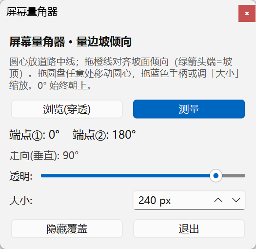
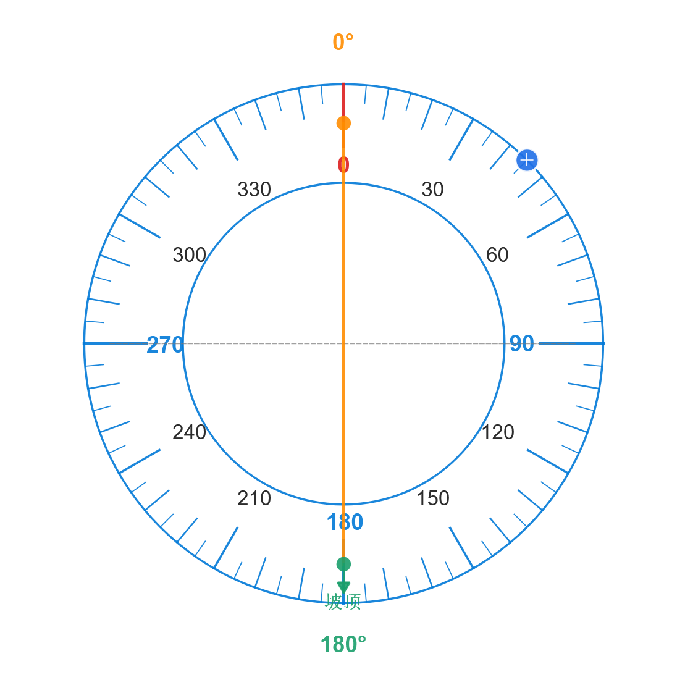

# [屏幕量角器 · 在地图上量取公路边坡走向与倾向](https://www.asgeologeekfan.top/posts/screen-protractor.html)

[点击下载](https://www.asgeologeekfan.top/project/ScreenProtractor.exe) (单文件 exe，免安装，Windows 7 / 10 / 11 64 位)

> 一款悬浮在地图之上的轻量级屏幕量角器，单文件 exe、免安装，专为公路边坡 / 地质灾害野外调查场景设计。

## 一、软件简介

屏幕量角器是一款为**公路边坡、地质灾害调查**场景设计的桌面小工具。它悬浮在 Google Earth、奥维互动地图、百度 / 高德地图等桌面软件之上，帮助你在地图上快速量取一条线段的**方位角**，进而读出坡面的**倾向**与**走向**——无需打开 CAD、无需复杂 GIS 软件，也不用纸笔比划。

整个程序是**单个 exe 文件**（约 45 MB），双击即用，无需安装 Python 或任何运行库，方便通过微信 / 邮件 / U 盘直接发给同事。

### 适用场景

- 在卫星影像上量取边坡的倾向与走向

### 核心特点

- **0° 始终朝上**：与屏幕正上方（地图正北）对齐，符合读图习惯；
- **量角器浮在地图上方**：半透明圆形，不遮挡地图细节；
- **测量线恒过圆心**：拖动任一端即可旋转对齐坡面，角度实时更新；
- **坡顶方向标识**：一端带绿色箭头 + “坡顶”标注，指向坡顶；
- **两端角度 + 走向自动读出**：控制面板同步显示两端方位角与垂直走向；
- **可调透明度 / 大小**：适应不同底图亮度与显示比例；
- **单文件、免安装**：Windows 直接运行。

## 二、下载与运行

1. 获取 `屏幕量角器.exe`（单文件，Windows 7 / 10 / 11 64 位）；
2. 双击运行即可，**无需安装任何运行库**；
3. 首次运行若被杀软拦截，请选择“允许”——程序仅做屏幕绘图与鼠标捕获，**不联网、不写入系统目录**；
4. 运行后会出现两个窗口：
   - **控制面板**（小窗，可操作）；
   - **量角器圆盘**（透明悬浮，浮在最上层）。

## 三、界面与术语

量角器圆盘各元素含义：

| 元素                 | 含义                                                         |
| -------------------- | ------------------------------------------------------------ |
| 蓝色圆环 + 内圈圆    | 量角器本体，0° 在正上方，顺时针 0–360°                       |
| 橙色实线（过圆心）   | 测量线，用于对齐坡面倾向                                     |
| 绿色箭头 + “坡顶”    | 测量线一端，指向**坡顶**方向                                 |
| 橙色端点             | 测量线另一端，指向**坡面倾向方位角**（坡向，即坡顶正对方向） |
| 灰色虚线（垂直）     | **走向**提示线（与测量线垂直）                               |
| 蓝色方块手柄（右上） | 拖拽缩放整个量角器                                           |
| 最外圈角度数字       | 两端实时方位角读数（绿端 = 坡顶端，橙端 = 坡向端）           |

**术语快速对照**

- **倾向（方位角）**：坡面朝哪个方向倾斜，用 0–360° 表示（0 = 正北 / 上，顺时针）。
- **走向**：坡面与水平面交线的方向，恒与倾向垂直。
- **坡顶**：坡面的最高一侧，由绿色箭头指示。

## 四、使用步骤

1. **启动程序**，量角器默认出现在屏幕中央，并处于「浏览(穿透)」状态（鼠标可穿透量角器去操作下层地图）。
2. **切换到「测量」模式**：在控制面板点击「测量」按钮，此时才能拖动量角器。
3. **放置圆心**：在量角器圆盘的白色区域（任意空白处）按住拖动，把**圆心**移到道路中线（或要量取的线段中点）。
4. **对齐坡面**：拖动橙色测量线（或任一端点的圆点），使其方向与坡面倾向一致——
   - 绿色箭头（坡顶）一端对准**坡顶**；
   - 橙色一端自然指向坡面**倾向方位角**。
5. **读取结果**：
   - 圆盘最外圈两个角度：绿端 = 坡顶端方位角，橙端 = 倾向方位角；
   - 控制面板「端点① / 端点②」同步显示两端角度；
   - 面板「走向(垂直)」给出与测量线垂直的走向角。
6. **微调显示**：
   - 拖动右上蓝色手柄，或在面板「大小」输入数值，缩放量角器；
   - 拖动「透明」滑块，让量角器更透 / 更实，避免遮挡底图；
   - 不需要读数时，点「隐藏覆盖」收起圆盘，需要时再点「显示覆盖」。
7. **退出**：点面板「退出」。

## 五、控制面板说明

| 控件                | 作用                                                         |
| ------------------- | ------------------------------------------------------------ |
| 浏览(穿透) / 测量   | 切换鼠标是否穿透量角器。浏览模式下可正常操作下层地图；测量模式下方可拖动量角器 |
| 端点① / 端点② 读数  | 实时显示测量线两端方位角（① = 橙端 / 坡向，② = 绿端 / 坡顶） |
| 走向(垂直) 读数     | 测量线垂直的走向角                                           |
| 透明 滑块           | 20%–100% 整体透明度                                          |
| 大小 输入           | 60–2000 px，直接输入半径缩放                                 |
| 隐藏覆盖 / 显示覆盖 | 收起或恢复悬浮圆盘                                           |
| 退出                | 关闭程序                                                     |

## 六、交互

- **移动圆心**：测量模式下，在圆盘白色区域内（任意空白处）按住拖动。
- **旋转测量线**：拖动橙色线身或任一端点圆点；线始终过圆心，不会脱离。
- **缩放**：拖动右上角蓝色方块手柄，或在面板「大小」中输入数值。
- **鼠标穿透**：默认「浏览」模式下，点击量角器会落到下层地图；需要操作量角器时切回「测量」。

## 七、测量原理与注意事项

- **方位角基准**：0° = 屏幕正上方 = 地图正北，顺时针递增。请确保地图已**正北朝上**显示，否则读数需按地图北偏角修正（真方位角 = 屏幕方位角 − 地图北偏角）。
- **平面量角**：本工具在**平面屏幕**上量取，得到的是屏幕方位角。若地图存在旋转或投影变形，结果仅作示意，精度以底图为准。
- **倾角不在范围内**：工具只量水平方位（倾向、走向），**不输出边坡倾角**——倾角需结合高程、等高线或实测获得。
- **多屏幕**：量角器初始居中于主屏，可拖动到任意位置；跨屏表现取决于系统缩放设置。

## 八、常见问题

**Q：双击没反应 / 被杀软拦了？**
单文件打包程序的常见现象。请在杀软中允许运行，或加入白名单。程序不联网、不写系统目录。

**Q：量角器挡住了地图，点不到下面的按钮？**
切到「浏览(穿透)」模式即可让鼠标穿透；需要移动量角器时再切回「测量」。

**Q：读数和我手算的不一致？**
检查地图是否正北朝上；本工具读到的是“屏幕方位角”，若底图有北偏角，需手动修正。

**Q：能测倾角吗？**
不能。平面地图只能量水平方位，倾角需高程数据。